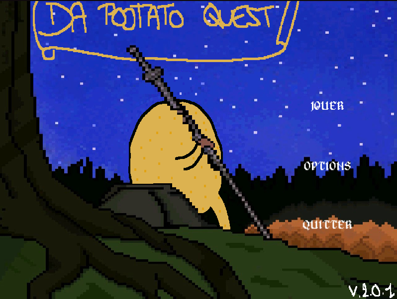
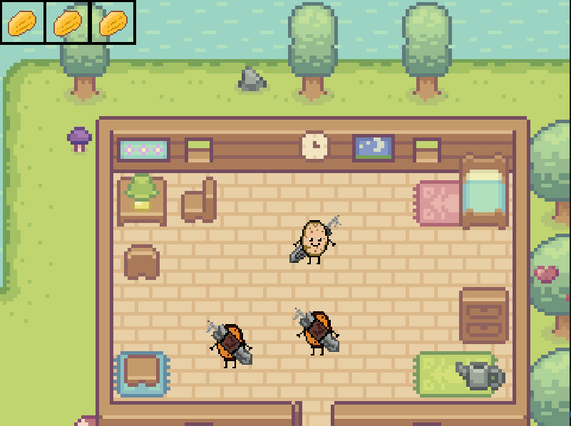

# Da Pootato Quest
This vertical slice was made in 2 weeks to introduce us to Game programming in C++ with SFML libs.   
All the animations were made by myself on Aseprite and the map was made on Tiled.   
Nothing much to say, we added a save manager to try things here and there but we won't complain about the final result.   

## Screen Samples :

